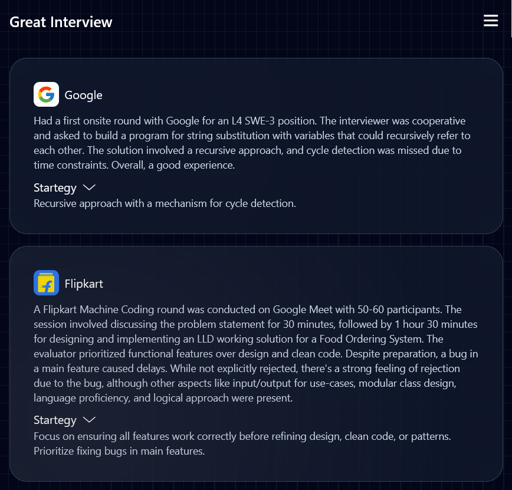
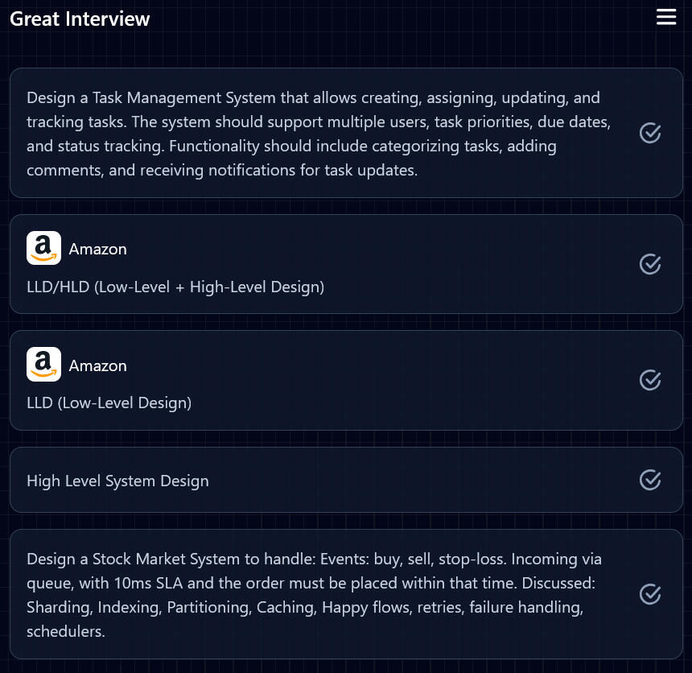
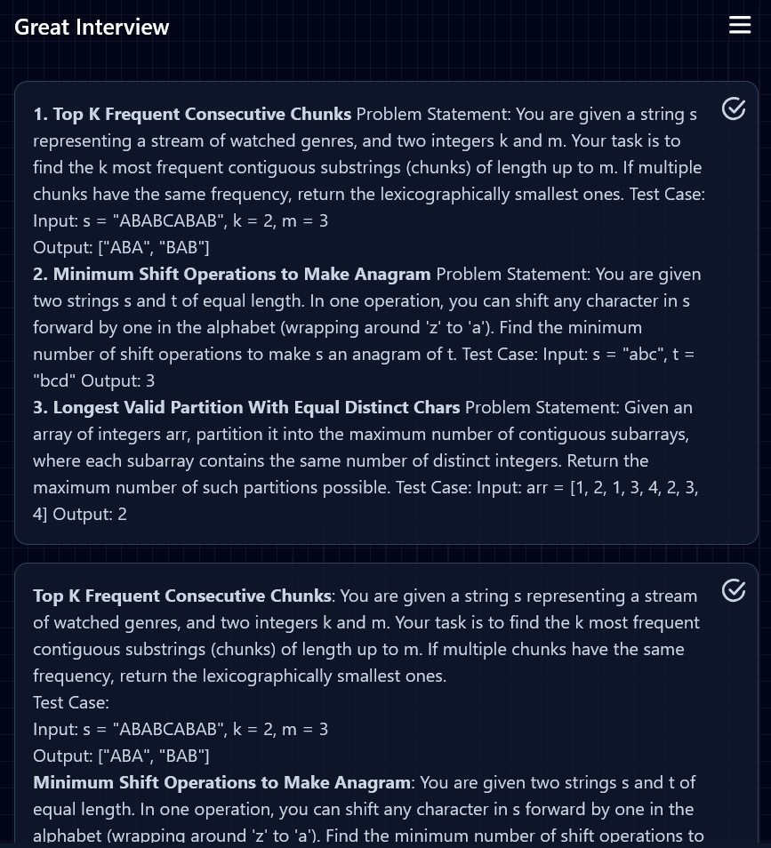

# ✨ Great-**interview**
# Screenshots

[Great interview](https://great-interview.vercel.app/) saves your time from learning through different interview experiences this platform helps people who want learn from different interview experiences without reading long blogs and rants about different interviews.
All the interviews are summarized into TLDRs with different strategies the helped engineers in passing their interviews.

We also have a section for **DSA** and **System design** questions curated by [**Gemini**](https://gemini.google.com/?hl=en-IN) with over 150+ different interview questions and 100+ System design questions with links to solve them in coding platforms like [Leetcode](https://www.leetcode.com).

# Features
- [x] Curated interview experiences to learn interview process for different interviews from top-tech companies at different levels.
- [x] Strategies used by engineers to get offers and ace interviews.
- [x] System design and interview questions sections to see the latest interview questions asked by companies.

# Upcoming features
- [ ]    Mock interviews with conversational AI that can help you in preparing for technical and behavioral interviews with feedback that helps you find the areas in which you can improve.
  

# Technologies used

- Express JS
- Supabase
- React JS
- [Gemini API](https://ai.google.dev/gemini-api/docs)
- Tailwind CSS
